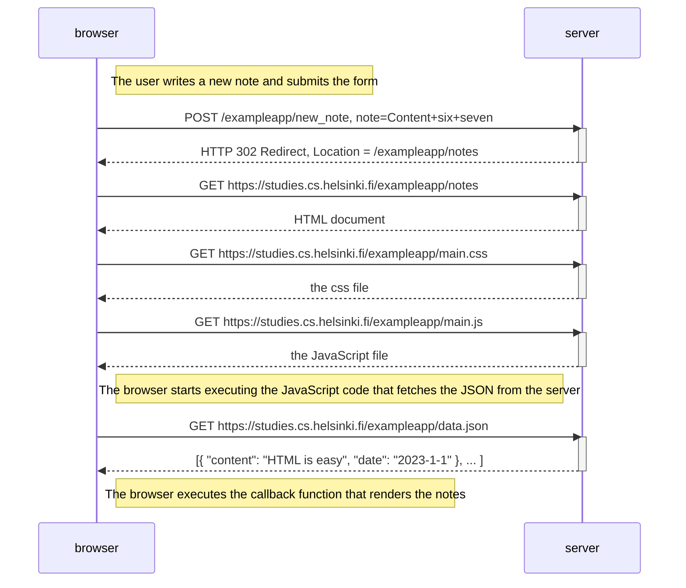
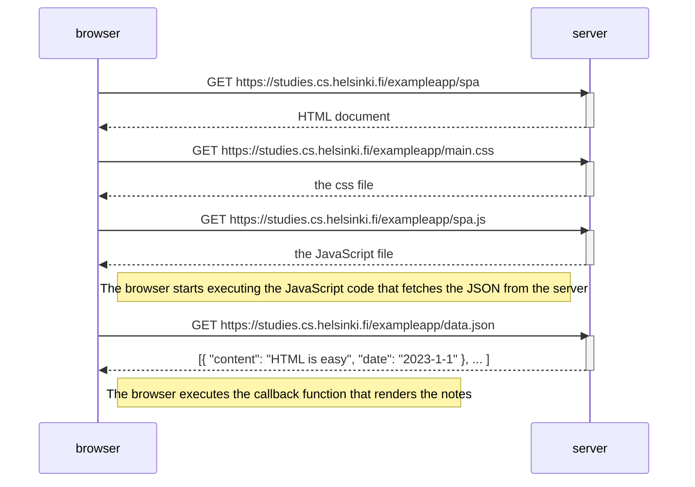
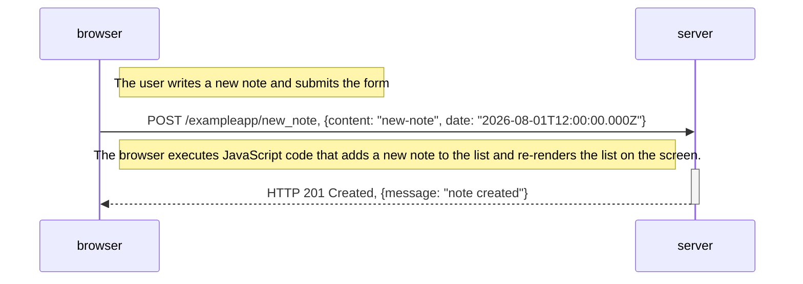

# Osa 0
## 0.4: uusi muistiinpano

```mermaid
sequenceDiagram
    participant browser
    participant server

    Note right of browser: The user writes a new note and submits the form
    browser->>server: POST /exampleapp/new_note, note=Content+six+seven
    activate server
    server-->>browser: HTTP 302 Redirect, Location = /exampleapp/notes
    deactivate server

    browser->>server: GET https://studies.cs.helsinki.fi/exampleapp/notes
    activate server
    server-->>browser: HTML document
    deactivate server
    
    browser->>server: GET https://studies.cs.helsinki.fi/exampleapp/main.css
    activate server
    server-->>browser: the css file
    deactivate server
    
    browser->>server: GET https://studies.cs.helsinki.fi/exampleapp/main.js
    activate server
    server-->>browser: the JavaScript file
    deactivate server

    Note right of browser: The browser starts executing the JavaScript code that fetches the JSON from the server
    
    browser->>server: GET https://studies.cs.helsinki.fi/exampleapp/data.json
    activate server
    server-->>browser: [{ "content": "HTML is easy", "date": "2023-1-1" }, ... ]
    deactivate server    


    Note right of browser: The browser executes the callback function that renders the notes 
```
## Osa 0.5: Single page app

```mermaid
sequenceDiagram
    participant browser
    participant server
    
    browser->>server: GET https://studies.cs.helsinki.fi/exampleapp/spa
    activate server
    server-->>browser: HTML document
    deactivate server
    
    browser->>server: GET https://studies.cs.helsinki.fi/exampleapp/main.css
    activate server
    server-->>browser: the css file
    deactivate server
    
    browser->>server: GET https://studies.cs.helsinki.fi/exampleapp/spa.js
    activate server
    server-->>browser: the JavaScript file
    deactivate server
    
    Note right of browser: The browser starts executing the JavaScript code that fetches the JSON from the server
    
    browser->>server: GET https://studies.cs.helsinki.fi/exampleapp/data.json
    activate server
    server-->>browser: [{ "content": "HTML is easy", "date": "2023-1-1" }, ... ]
    deactivate server    

    Note right of browser: The browser executes the callback function that renders the notes 
``` 
## Osa 0.6: Uusi muistiinpano

```mermaid
sequenceDiagram
    participant browser
    participant server

    Note right of browser: The user writes a new note and submits the form
    browser->>server: POST /exampleapp/new_note, {content: "new-note", date: "2026-08-01T12:00:00.000Z"}
    Note right of browser: The browser executes JavaScript code that adds a new note to the list and re-renders the list on the screen.  
    activate server
    server-->>browser: HTTP 201 Created, {message: "note created"}
    deactivate server
``` 